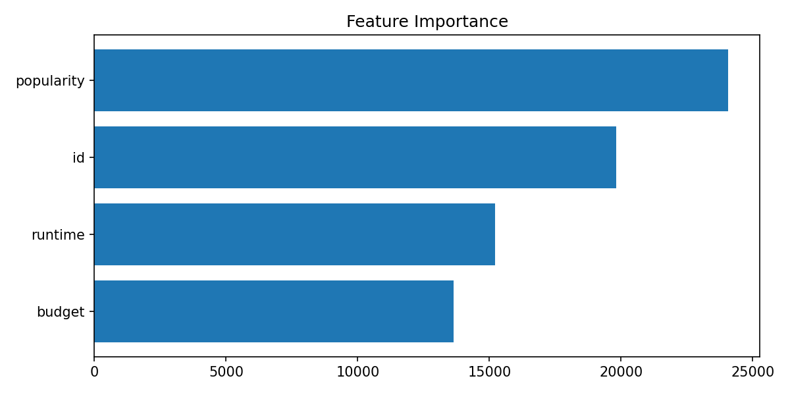

# TMDB Box Office Prediction & Movie Recommender

This repository contains an end-to-end machine learning project built on the **TMDB Box Office Prediction** dataset.  
The goal is to **predict movie box office revenue (log-revenue)** and to build a **content-based movie recommender**.

---

## 1. Project Overview

**Main tasks:**

1. Clean and preprocess the TMDB movie dataset (budget, revenue, popularity, genres, cast, crew, etc.).
2. Engineer meaningful numerical and categorical features.
3. Build regression models to predict **log(revenue)**:
   - Strong baseline with LightGBM
   - Stacking ensemble of LightGBM, XGBoost and CatBoost with a RidgeCV meta-learner
4. Build a **content-based recommender system** using sentence-transformer embeddings.
5. Generate diagnostic plots (residuals, actual vs predicted, learning curves, feature importance).

This project shows practical skills in **regression, feature engineering, ensemble models, and recommender systems**.

---

## 2. Data

The project uses the public **TMDB Box Office Prediction** dataset (Kaggle).

Key columns used:

- `budget`, `revenue`, `popularity`, `runtime`
- `genres`, `cast`, `crew`, `production_companies`, `production_countries`
- `release_date`, `original_language`, `title`, `overview`, `tagline`

Target variable:

- `revenue_log = log1p(revenue)`

---

## 3. Feature Engineering

Some of the main feature engineering steps:

- Parse JSON-like fields (`genres`, `cast`, `crew`, `production_companies`, `production_countries`).
- Extract:
  - main genre
  - number of genres
  - indicators for top genres, top actors, top directors and top production companies
- Create time-based features:
  - `release_year`, `release_month`
  - `is_sequel` flag from the movie title
- Handle skewed variables:
  - winsorization of `budget` and `popularity`
  - `budget_log`, `revenue_log`, `popularity_log`
- Text features:
  - Combine `overview`, genres, keywords, cast and crew names into a single text field.
  - Apply **TF-IDF** + **TruncatedSVD** to obtain dense text embeddings.

---

## 4. Models

### 4.1 Base Model – LightGBM

A tuned `LGBMRegressor` is trained on engineered features + SVD text embeddings.

Example performance on the hold-out set (log-revenue):

- **RMSE ≈ 2.11**
- **MAE ≈ 1.45**
- **R² ≈ 0.50**
- **MAPE ≈ 14%**

### 4.2 Stacking Ensemble

Stacking of three tree-based models:

- LightGBM
- XGBoost
- CatBoost

Out-of-fold predictions are used to train a **RidgeCV** meta-learner.

Ensemble performance (log-revenue):

- **RMSE ≈ 2.05**
- **MAE ≈ 1.38**
- **R² ≈ 0.53**
- **MAPE ≈ 13.8%**

This setup provides a solid and relatively robust model for box office prediction.

---

## 5. Movie Recommender

A simple **content-based recommender** is built using:

- `sentence-transformers/all-mpnet-base-v2` embeddings
- A combined text field with:
  - overview
  - genres
  - keywords
  - main cast
  - directors

Two main use cases:

1. **Recommend similar movies by title**  
   Example: recommendations for *"The Dark Knight"*.
2. **Recommend movies based on a free-text query**  
   Example: "dark crime thriller with a complex plot".

The recommender returns movies ranked by similarity score.

---

## 6. Diagnostic Plots

The repository includes several figures under the `figures/` folder:

- `residuals.png` – Residual distribution for log-revenue  
- `pred_vs_actual.png` – Actual vs Predicted (log-revenue)  
- `feature_importance.png` – Top feature importances from the tree model  
- `learning_curve_cv.png` – Train vs validation RMSE (cross-validation)  
- `learning_curve_holdout.png` – Train vs test RMSE (hold-out learning curve)  

Examples:




---

## 7. Tech Stack

- **Python**
- `pandas`, `numpy`
- `scikit-learn`
- `lightgbm`, `xgboost`, `catboost`
- `matplotlib`
- `sentence-transformers`

---

## 8. How to Run

1. Clone or download this repository.
2. Install dependencies (e.g. via `conda` or `pip`).
3. Ensure the TMDB train CSV is available and update the `csv_path` in `tmdb_portfolio.py` if needed.
4. Run:

```bash
python tmdb_portfolio.py
